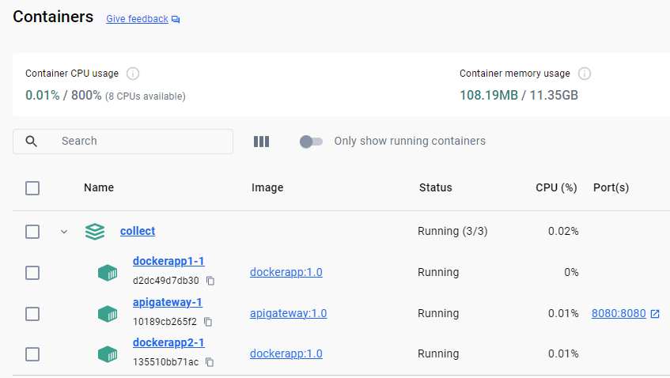

# Portifolio Project
- Purpose: Demonstrate utilization of API Gateway using OCELOT, API versioning, Swagger for API documentation
- Stack: .Net 8.0, Ocelot, Docker, Docker-Compose

## Running instructions
- On Windows OS, go to the project root folder and run command:
```
build.bat
```
- And then
```
up.bat
```
Obs: Docker is required

## After docker containers become online
You should get something like this:


Now, use any browser to test the application:

##### API Gateway Endpoint /test
> http://localhost:8080/test

##### API Gateway Endpoint /calculate1
> http://localhost:8080/calculate1/ab19fa17-22a9-4613-920e-06eb092f4f94

##### API Gateway Endpoint /calculate2
> http://localhost:8080/calculate2/41b0219b-2b33-4ebc-bbe5-ddcd431b0bc5

